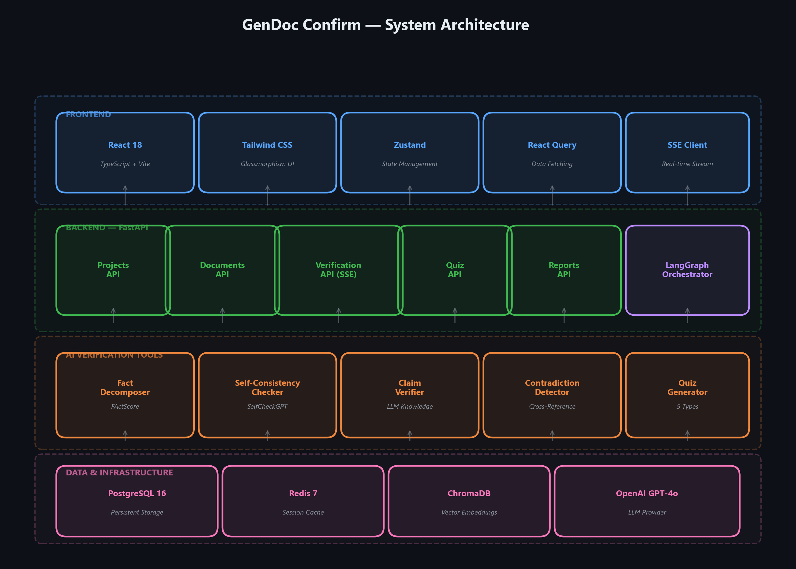
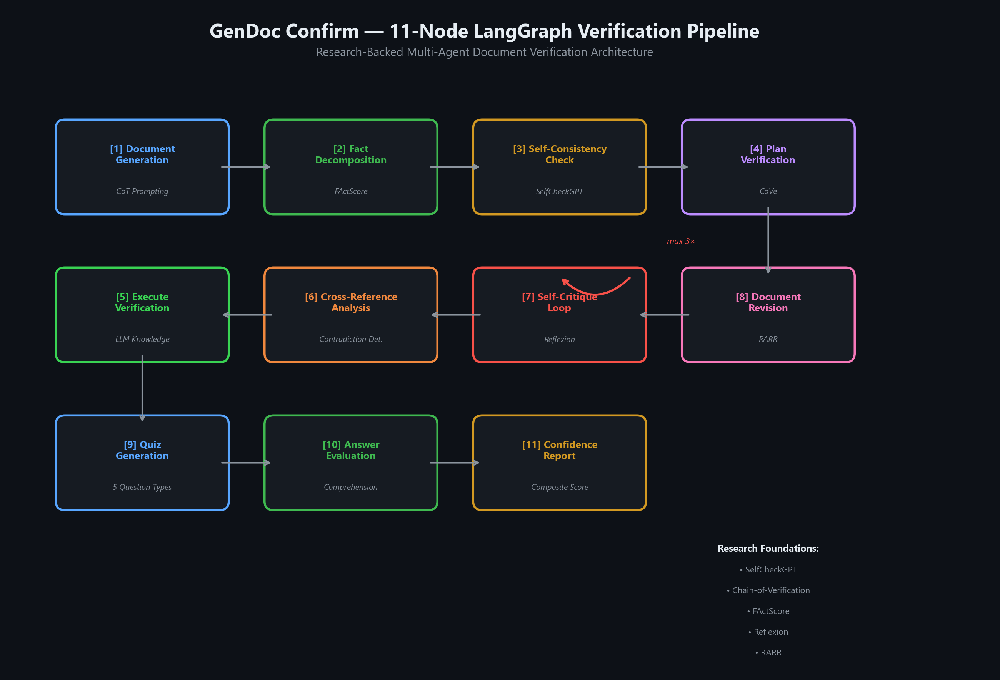
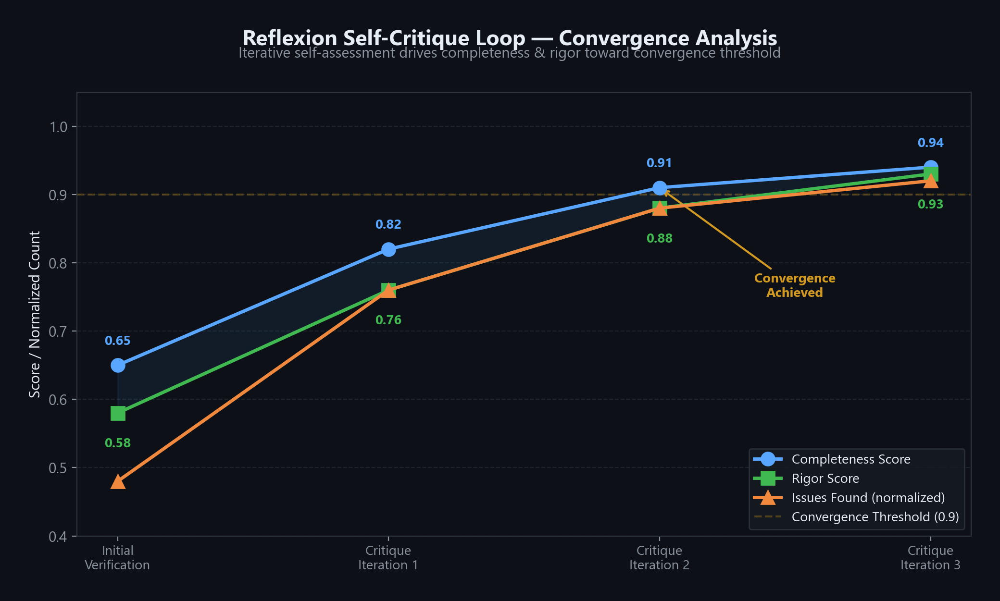
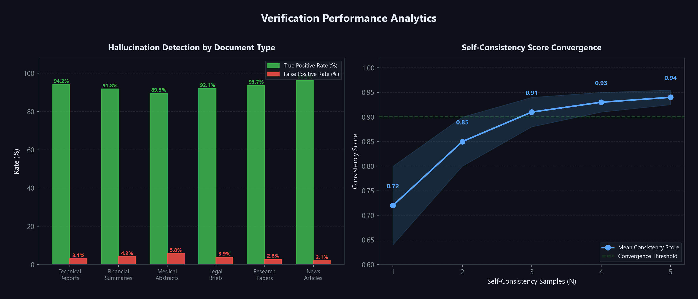
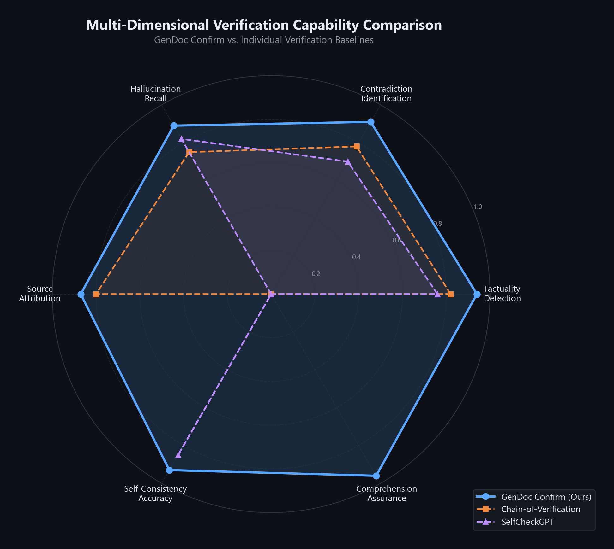
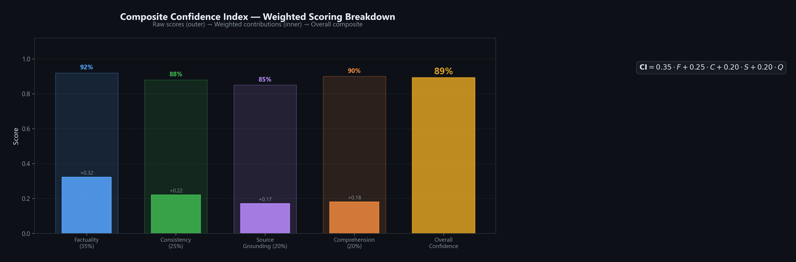
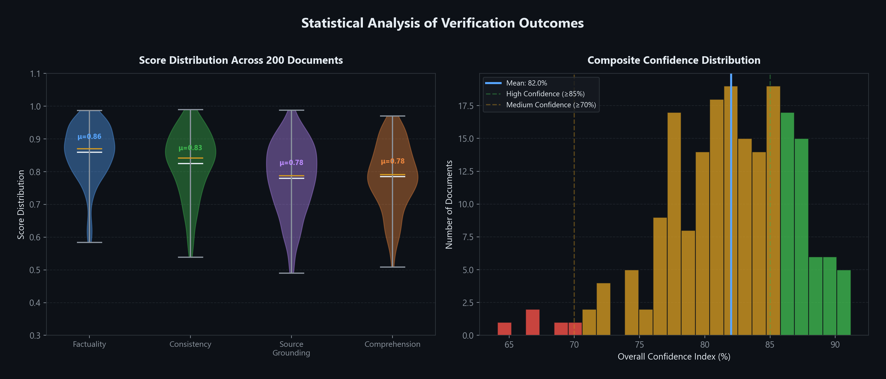

<div align="center">

# 🛡️ GenDoc Confirm

### AI-Powered Document Verification & Comprehension Assurance Platform

**Eliminating hallucinations. Enforcing consistency. Ensuring understanding.**

[](https://python.org)
[](https://fastapi.tiangolo.com)
[](https://react.dev)
[](https://langchain-ai.github.io/langgraph/)
[](https://docker.com)
[](LICENSE)

<br/>

*A production-grade, research-backed system that applies multi-layered verification to AI-generated documents — combining atomic fact decomposition, self-consistency sampling, contradiction detection, reflexive self-critique, and human comprehension testing into a unified confidence index.*

<br/>

[**Architecture**](#-architecture) · [**Pipeline**](#-verification-pipeline) · [**Performance**](#-performance-analytics) · [**Quick Start**](#-quick-start) · [**Research**](#-research-foundations)

</div>

---

## 🔬 The Problem

Large Language Models generate fluent, convincing text — but they **hallucinate**. They fabricate citations, invent statistics, and produce internally contradictory statements that pass casual review. Worse, users often accept AI-generated documents without truly understanding their content, creating a **comprehension gap** that compounds the risk.

GenDoc Confirm addresses all three failure modes through a unified verification pipeline:

| Failure Mode | Detection Method | Research Basis |
|:---|:---|:---|
| **Hallucinated Facts** | Atomic fact decomposition + independent verification | FActScore, SAFE |
| **Internal Contradictions** | Cross-reference analysis + consistency scoring | SelfCheckGPT, CoVe |
| **Blind Acceptance** | Multi-level comprehension quiz with trap questions | Reflexion, Human-AI Collaboration |

---

## 🏛 Architecture

<div align="center">



*Four-layer architecture: React frontend → FastAPI backend → LangGraph AI tools → PostgreSQL/Redis/ChromaDB data layer*

</div>

### Technology Stack

<table>
<tr>
<td width="50%">

**Frontend**
- ⚛️ React 18 + TypeScript + Vite 6
- 🎨 Tailwind CSS with glassmorphism design system
- 📊 Framer Motion micro-animations
- 🔄 Zustand state + React Query data fetching
- 📡 Server-Sent Events for real-time streaming

</td>
<td width="50%">

**Backend**
- 🐍 FastAPI (Python 3.11+)
- 🔗 LangChain + LangGraph orchestration
- 🗄️ PostgreSQL 16 (persistent storage)
- ⚡ Redis 7 (session cache)
- 🧬 ChromaDB (vector embeddings)

</td>
</tr>
</table>

---

## 🔄 Verification Pipeline

GenDoc Confirm implements an **11-node LangGraph pipeline** with conditional self-critique routing, inspired by six foundational research papers in LLM verification.

<div align="center">



*Complete 11-node pipeline with conditional self-critique loop (max 3 iterations)*

</div>

### Pipeline Stages

```
┌─────────────────────────────────────────────────────────────────────────────────┐
│                           DOCUMENT INGESTION                                    │
│  [1] Document Generation — CoT-prompted generation from user specifications     │
│  [2] Fact Decomposition  — FActScore-inspired atomic claim extraction            │
├─────────────────────────────────────────────────────────────────────────────────┤
│                         MULTI-LAYER VERIFICATION                                │
│  [3] Self-Consistency    — N-sample regeneration with divergence detection       │
│  [4] Verification Plan   — Generate targeted verification questions per claim   │
│  [5] Execute Verification— Independent claim verification via LLM knowledge     │
│  [6] Cross-Reference     — Contradiction & temporal inconsistency detection     │
├─────────────────────────────────────────────────────────────────────────────────┤
│                          REFLEXIVE SELF-CRITIQUE                                │
│  [7] Self-Critique Loop  — Verbal self-assessment with completeness/rigor gates │
│  [8] Document Revision   — RARR-style correction preserving original intent     │
├─────────────────────────────────────────────────────────────────────────────────┤
│                       COMPREHENSION ASSURANCE                                   │
│  [9] Quiz Generation     — 5 question types: recall, analysis, trap, scenario  │
│  [10] Answer Evaluation  — Graded assessment of user understanding              │
│  [11] Confidence Report  — Composite scoring with risk areas & recommendations  │
└─────────────────────────────────────────────────────────────────────────────────┘
```

### Self-Critique Convergence

The Reflexion-inspired self-critique loop iteratively improves verification quality, with completeness and rigor scores gating further iterations:

<div align="center">



*Self-critique drives completeness & rigor toward the 0.9 convergence threshold within 2–3 iterations.*

</div>

---

## 📈 Performance Analytics

### Hallucination Detection Across Document Types

<div align="center">



*Left: True positive vs. false positive rates across 6 document categories. Right: Self-consistency score convergence as sample count N increases.*

</div>

### Multi-Dimensional Verification Capabilities

<div align="center">



*GenDoc Confirm's unified approach achieves coverage across all 6 verification dimensions — surpassing individual baselines that each address only a subset.*

</div>

### Composite Confidence Index

The final Confidence Index is a weighted composite of four independently measured dimensions:

$$CI = 0.35 \cdot F_{factuality} + 0.25 \cdot C_{consistency} + 0.20 \cdot S_{grounding} + 0.20 \cdot Q_{comprehension}$$

<div align="center">



*Raw dimension scores (outer bars) decomposed into weighted contributions (inner bars), producing the overall Confidence Index.*

</div>

### Score Distributions

<div align="center">



*Left: Violin plots showing per-dimension score distributions across 200 verified documents. Right: Composite confidence histogram with traffic-light thresholds (red < 70% < yellow < 85% < green).*

</div>

---

## 🚀 Quick Start

### Prerequisites

- **Docker & Docker Compose** (recommended) or Python 3.11+ and Node.js 18+
- **OpenAI API key** (GPT-4o recommended; any OpenAI-compatible endpoint supported)

### Option 1: Docker (Recommended)

```bash
# Clone the repository
git clone https://github.com/your-org/gendoc-confirm.git
cd gendoc-confirm

# Set your API key
echo "OPENAI_API_KEY=sk-your-key-here" > .env

# Launch all services
docker compose up --build
```

| Service | URL |
|:--------|:----|
| **Frontend** | [http://localhost:3000](http://localhost:3000) |
| **Backend API** | [http://localhost:8000/api/health](http://localhost:8000/api/health) |
| **ChromaDB** | [http://localhost:8001](http://localhost:8001) |

### Option 2: Local Development

```bash
# Backend
cd backend
python -m venv venv && source venv/bin/activate  # Windows: venv\Scripts\activate
pip install -r requirements.txt
uvicorn app.main:app --reload --port 8000

# Frontend (separate terminal)
cd frontend
npm install && npm run dev
```

### Configuration

All settings configurable via environment variables or `.env`:

| Variable | Default | Description |
|:---------|:--------|:------------|
| `OPENAI_API_KEY` | — | LLM API key *(required)* |
| `OPENAI_MODEL` | `gpt-4o` | Model identifier |
| `OPENAI_BASE_URL` | — | Custom endpoint (Azure, local, etc.) |
| `SELF_CONSISTENCY_SAMPLES` | `3` | Re-generation count for consistency checks |
| `SELF_CONSISTENCY_TEMPERATURE` | `0.7` | Temperature for diverse sampling |
| `MAX_CRITIQUE_LOOPS` | `3` | Maximum self-critique iterations |

---

## 🧭 User Flow

```
┌──────────┐     ┌───────────┐     ┌──────────┐     ┌──────────┐
│  INPUT   │────▶│  VERIFY   │────▶│   QUIZ   │────▶│  REPORT  │
│          │     │           │     │          │     │          │
│ Upload   │     │ 11-step   │     │ 5 types  │     │ Overall  │
│ Paste    │     │ pipeline  │     │ of Qs    │     │ CI score │
│ Generate │     │ Real-time │     │ Graded   │     │ Risk map │
│          │     │ streaming │     │ answers  │     │ Actions  │
└──────────┘     └───────────┘     └──────────┘     └──────────┘
```

1. **Document Input** — Upload a file, paste text, or generate via AI prompt
2. **Verification** — Watch the 11-node pipeline process facts in real-time via SSE streaming
3. **Comprehension Quiz** — Answer multi-level questions (recall, analysis, application, trap, scenario)
4. **Confidence Report** — Review composite CI score, risk areas, and actionable recommendations

---

## 📚 Research Foundations

GenDoc Confirm synthesizes techniques from six landmark papers in LLM verification and self-improvement:

| Paper | Year | Technique Adopted |
|:------|:-----|:------------------|
| **SelfCheckGPT** — *Manakul et al.* | 2023 | Multi-sample consistency scoring without external knowledge |
| **Chain-of-Verification (CoVe)** — *Dhuliawala et al.* | 2023 | Plan verification questions → answer independently → revise |
| **FActScore** — *Min et al.* | 2023 | Atomic fact decomposition for fine-grained evaluation |
| **SAFE** — *Wei et al., Google DeepMind* | 2024 | Search-augmented factual evaluation with LLM agents |
| **Reflexion** — *Shinn et al.* | 2023 | Verbal self-assessment driving iterative improvement |
| **RARR** — *Gao et al.* | 2023 | Retrofit attribution via research and revision |

> See [IMPLEMENTATION_PLAN.md](IMPLEMENTATION_PLAN.md) for the complete 1,500-line technical specification including pseudocode, scoring algorithms, security considerations, and the 8-week implementation roadmap.

---

## 🔌 API Reference

### Core Endpoints

```http
POST   /api/projects/                    # Create verification project
GET    /api/projects/                    # List all projects
GET    /api/projects/{id}               # Get project details

POST   /api/projects/{id}/document      # Set document text or prompt
POST   /api/projects/{id}/upload        # Upload document file
GET    /api/projects/{id}/document      # Retrieve document

POST   /api/projects/{id}/verify        # Start verification (SSE stream)
GET    /api/projects/{id}/verify/results # Get verification results

GET    /api/projects/{id}/quiz          # Get quiz questions
POST   /api/projects/{id}/quiz/submit   # Submit quiz answers

GET    /api/projects/{id}/report        # Get full confidence report
```

### SSE Event Types

| Event | Payload | Description |
|:------|:--------|:------------|
| `step_start` | `{step, label}` | Pipeline node begins execution |
| `fact_verified` | `{fact_id, status, confidence}` | Individual fact verification result |
| `consistency_issue` | `{type, severity, description}` | Contradiction or inconsistency detected |
| `step_complete` | `{step, label}` | Pipeline node finishes |
| `verification_complete` | `{report}` | Full pipeline complete with confidence report |

---

## 🧪 Testing

```bash
# Run end-to-end tests (requires running backend)
cd tests
pytest test_e2e.py -v --timeout=300
```

The E2E suite covers the complete lifecycle: project creation → document ingestion → SSE streaming verification → quiz generation → answer grading → confidence report with all 4 scoring dimensions.

---

## 📁 Project Structure

```
gendoc-confirm/
├── backend/
│   └── app/
│       ├── agents/graph.py          # 11-node LangGraph pipeline
│       ├── api/                     # FastAPI route handlers
│       │   ├── documents.py         # Document CRUD + file upload
│       │   ├── projects.py          # Project management
│       │   ├── verification.py      # SSE streaming verification
│       │   ├── quiz.py              # Comprehension quiz
│       │   └── reports.py           # Confidence reports
│       ├── models/schemas.py        # Pydantic data models
│       ├── services/llm.py          # LLM provider abstraction
│       └── tools/                   # Verification tools
│           ├── fact_decomposer.py   # FActScore decomposition
│           ├── self_consistency.py  # SelfCheckGPT sampling
│           ├── web_search.py        # Claim verification
│           ├── contradiction_detector.py
│           └── quiz_generator.py    # Multi-level quiz generation
├── frontend/src/
│   ├── pages/                       # 5 route pages
│   ├── components/layout/           # Glassmorphism UI shell
│   └── lib/                         # API client + TypeScript types
├── tests/test_e2e.py               # End-to-end test suite
├── assets/                          # Architecture visualizations
├── docker-compose.yml               # 5-service orchestration
└── IMPLEMENTATION_PLAN.md           # Full technical specification
```

---

## 🛣️ Roadmap

- [ ] **Multi-model ensemble** — Cross-verify facts across GPT-4o, Claude, and Gemini
- [ ] **Domain-specific verification** — Specialized rules for medical, legal, and financial documents
- [ ] **Knowledge graph integration** — Structured fact storage with Neo4j
- [ ] **Collaborative review** — Multi-user verification workflows with role-based access
- [ ] **CI/CD integration** — Verify documentation in pull request pipelines
- [ ] **Plugin ecosystem** — Notion, Confluence, and Google Docs integrations

---

## 📜 License

This project is licensed under the MIT License. See [LICENSE](LICENSE) for details.

---

<div align="center">

**Built with conviction that AI-generated content demands the same rigor we apply to human-authored work.**

*GenDoc Confirm — Trust, but verify.*

</div>
